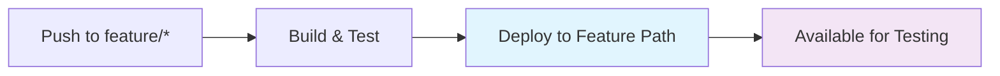
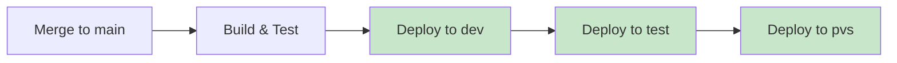
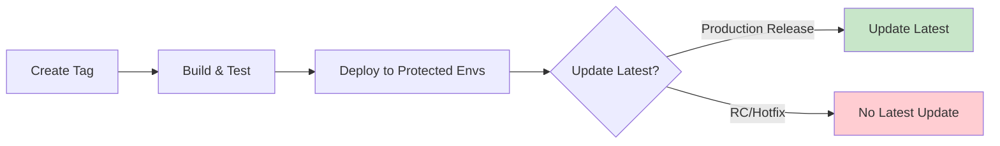

# Developer Deployment Guide: Trunk-Based Development + SemVer Strategy

## Table of Contents
1. [Overview & Principles](#overview--principles)
2. [Environment Strategy](#environment-strategy)
3. [Branch Strategy](#branch-strategy)
4. [SemVer & Tagging Strategy](#semver--tagging-strategy)
5. [CDN Path Structure](#cdn-path-structure)
6. [Deployment Workflows](#deployment-workflows)
7. [Best Practices](#best-practices)
8. [Examples & Scenarios](#examples--scenarios)
9. [Troubleshooting](#troubleshooting)

---

## Overview & Principles

### 🌿 Trunk-Based Development
We follow **trunk-based development** where all development happens on the `main` branch with short-lived feature branches. This approach enables:
- **Continuous Integration**: Every commit is tested immediately
- **Reduced Merge Conflicts**: Short-lived branches minimize integration issues
- **Faster Delivery**: No waiting for release branches to be "ready"
- **Simplified Workflow**: One source of truth for the latest code

### 🎯 Core Principles
1. **Main branch is always deployable**
2. **Feature branches are short-lived** (<24 hours preferred)
3. **Tags trigger production deployments**
4. **SemVer guides version management**
5. **Environment protection through GitHub**

---

## Environment Strategy

### 🏢 Environment Hierarchy

| Environment | Protection Level | Auto-Deploy Source | Purpose |
|-------------|------------------|-------------------|---------|
| **dev** | ❌ Unprotected | `main` branch commits | Development testing |
| **test** | 🔒 Protected | `main` branch (after dev) | QA testing |
| **pvs** | 🔒 Protected | `main` branch (after test) | Performance/Volume testing |
| **demo** | 🔒 Protected | Tagged versions only | Client demonstrations |
| **review** | 🔒 Protected | Tagged versions only | Stakeholder review |
| **prod-chk** | 🔒 Protected | Tagged versions only | Production validation |
| **prod** | 🔒 Protected | Tagged versions only | Live production |

### 🛡️ Environment Protection Rules

```yaml
# GitHub Environment Configuration
environments:
  dev:
    protection_rules: []  # No protection - auto-deploy
    
  test:
    protection_rules:
      - required_reviewers: ["qa-team"]
      - wait_timer: 5  # 5 minutes
    
  pvs:
    protection_rules:
      - required_reviewers: ["performance-team"]
      - wait_timer: 10
    
  demo:
    protection_rules:
      - required_reviewers: ["product-team"]
      - deployment_branch_policy: ["main"]
      - only_tagged_versions: true
    
  review:
    protection_rules:
      - required_reviewers: ["stakeholders"]
      - deployment_branch_policy: ["main"] 
      - only_tagged_versions: true
    
  prod-chk:
    protection_rules:
      - required_reviewers: ["platform-team", "security-team"]
      - deployment_branch_policy: ["main"]
      - only_tagged_versions: true
    
  prod:
    protection_rules:
      - required_reviewers: ["platform-leads", "engineering-manager"]
      - deployment_branch_policy: ["main"]
      - only_tagged_versions: true
      - manual_promotion_required: true
```

---

## Branch Strategy

### 🌳 Branch Types & Rules

#### 1. **Main Branch** (`main`)
- **Always deployable**
- **Protected branch** with required PR reviews
- **Continuous deployment** to dev → test → pvs
- **Source of truth** for all releases

#### 2. **Feature Branches** (`feature/*`)
- **Short-lived** (<24 hours preferred, max 48 hours)
- **Must start with `feature/`** prefix
- **Deploy to feature CDN path** (not latest)
- **Must be merged via PR** with squash merge

#### 3. **Hotfix Branches** (`hotfix/*`)
- **Emergency fixes only**
- **Branch from production tag**
- **Merge immediately to main**
- **Tag after merge** with hotfix metadata

### 🚫 Forbidden Branches
- ❌ `develop` or `development`
- ❌ `release/*` (use tags instead)
- ❌ Long-lived feature branches
- ❌ Environment-specific branches

### ✅ Branch Naming Conventions

```bash
# ✅ Good branch names
feature/JIRA-123-user-authentication
feature/savings-calculation-fix
feature/new-dashboard-ui

# ✅ Hotfix branch names  
hotfix/JIRA-456-critical-security-fix
hotfix/savings-display-bug

# ❌ Bad branch names
develop
release/v2.1.0
feature-branch
fix
new-stuff
```

---

## SemVer & Tagging Strategy

### 📋 Semantic Versioning Convention

We follow **Semantic Versioning 2.0.0** with build metadata for special cases:

```
MAJOR.MINOR.PATCH[+metadata]

Examples:
v2.1.4           - Production release
v2.1.5-rc.1      - Release candidate
v2.1.4+hotfix.1  - Hotfix
v2.2.0-beta.1    - Beta release
```

### 🏷️ Tag Types & Latest Update Rules

| Tag Format | Updates Latest? | Environment Access | Purpose |
|------------|----------------|-------------------|---------|
| `v2.1.4` | ✅ **YES** | All protected envs | Production release |
| `v2.1.5-rc.1` | ❌ **NO** | demo, review, prod-chk | Release candidate |
| `v2.1.4+hotfix.1` | ❌ **NO** | demo, review, prod-chk | Emergency hotfix |
| `v2.2.0-beta.1` | ❌ **NO** | demo, review | Beta testing |
| `v2.1.5-alpha.1` | ❌ **NO** | demo, review | Alpha testing |

### 🎯 Latest Update Logic

```javascript
// Pseudo-code for latest update decision
function shouldUpdateLatest(tag) {
    const semver = parseSemver(tag);
    
    // Only update latest for clean production releases
    if (semver.prerelease || semver.metadata) {
        return false;  // RC, hotfix, beta, alpha don't update latest
    }
    
    return true;  // Clean version (v2.1.4) updates latest
}

// Examples:
shouldUpdateLatest("v2.1.4");        // true  - updates latest
shouldUpdateLatest("v2.1.5-rc.1");   // false - RC, no latest update
shouldUpdateLatest("v2.1.4+hotfix.1"); // false - hotfix, no latest update
```

### 📅 Tagging Workflow

```bash
# 1. Ensure main is ready for release
git checkout main
git pull origin main

# 2. Create and push tag
git tag -a v2.1.4 -m "Release v2.1.4: New savings calculator"
git push origin v2.1.4

# 3. GitHub Actions automatically:
#    - Deploys to protected environments
#    - Updates latest (if production release)
#    - Creates deployment tracking issue
```

---

## CDN Path Structure

### 🗂️ Complete CDN Directory Structure

```
https://cdn.example.com/
├── {domain}/                           # Business domain (pharmacy, billing, etc.)
│   ├── {bounded-context}/              # DDD bounded context (savings-card, etc.)
│   │   ├── {component}/                # Microfrontend component
│   │   │   ├── environments/           # Environment-specific deployments
│   │   │   │   ├── dev/
│   │   │   │   │   └── latest/         # 🔄 Auto-updated from main
│   │   │   │   ├── test/
│   │   │   │   │   └── latest/         # 🔄 Auto-updated from main
│   │   │   │   ├── pvs/
│   │   │   │   │   └── latest/         # 🔄 Auto-updated from main
│   │   │   │   ├── demo/
│   │   │   │   │   ├── latest/         # 📍 Manual promotion only
│   │   │   │   │   ├── v2.1.4/         # Tagged versions
│   │   │   │   │   └── v2.1.5-rc.1/    # Release candidates
│   │   │   │   ├── review/
│   │   │   │   │   ├── latest/         # 📍 Manual promotion only
│   │   │   │   │   ├── v2.1.4/         # Tagged versions
│   │   │   │   │   └── v2.1.5-rc.1/    # Release candidates
│   │   │   │   ├── prod-chk/
│   │   │   │   │   ├── latest/         # 📍 Manual promotion only
│   │   │   │   │   ├── v2.1.4/         # Tagged versions
│   │   │   │   │   └── v2.1.5-rc.1/    # Release candidates
│   │   │   │   └── prod/
│   │   │   │       ├── latest/         # 📍 Manual promotion only
│   │   │   │       ├── v2.1.4/         # Current production
│   │   │   │       ├── v2.1.3/         # Previous production
│   │   │   │       └── v2.1.4+hotfix.1/ # Hotfixes (no latest update)
│   │   │   ├── feature-branches/       # Feature branch deployments
│   │   │   │   ├── feature-JIRA-123-auth/
│   │   │   │   ├── feature-savings-calc/
│   │   │   │   └── feature-dashboard-ui/
│   │   │   └── latest/                 # 🎯 Points to current stable
│   │   └── {another-component}/
│   └── {another-bounded-context}/
└── {another-domain}/
```

### 🎯 CDN Path Examples

```bash
# Real-world CDN paths
https://cdn.example.com/
├── pharmacy/savings-card/savings-advisor/
│   ├── environments/
│   │   ├── dev/latest/                 # Development environment
│   │   ├── test/latest/                # QA testing environment
│   │   ├── pvs/latest/                 # Performance testing
│   │   ├── demo/
│   │   │   ├── latest/                 # Current demo version
│   │   │   ├── v2.1.4/                 # Stable demo release
│   │   │   └── v2.1.5-rc.1/            # Demo of upcoming release
│   │   ├── review/
│   │   │   ├── latest/                 # Current review version
│   │   │   └── v2.1.5-rc.1/            # Stakeholder review candidate
│   │   ├── prod-chk/
│   │   │   ├── latest/                 # Production validation
│   │   │   └── v2.1.5-rc.1/            # Pre-production testing
│   │   └── prod/
│   │       ├── latest/                 # 🔥 LIVE PRODUCTION
│   │       ├── v2.1.4/                 # Current production release
│   │       └── v2.1.4+hotfix.1/        # Emergency hotfix
│   ├── feature-branches/
│   │   ├── feature-JIRA-456-new-ui/    # Feature branch testing
│   │   └── feature-savings-display/    # Another feature branch
│   └── latest/                         # Global latest (points to prod/latest)
└── billing/payment-processing/payment-widget/
    ├── environments/
    │   ├── dev/latest/
    │   └── prod/latest/
    └── latest/
```

### 🔗 URL Construction Logic

```javascript
// CDN URL construction
class CDNPathBuilder {
    constructor(baseUrl = 'https://cdn.example.com') {
        this.baseUrl = baseUrl;
    }
    
    // Environment-specific paths
    buildEnvironmentPath(domain, context, component, environment, version = 'latest') {
        return `${this.baseUrl}/${domain}/${context}/${component}/environments/${environment}/${version}/`;
    }
    
    // Feature branch paths
    buildFeaturePath(domain, context, component, branchName) {
        const safeBranchName = branchName.replace(/[^a-zA-Z0-9-]/g, '-');
        return `${this.baseUrl}/${domain}/${context}/${component}/feature-branches/${safeBranchName}/`;
    }
    
    // Versioned paths
    buildVersionPath(domain, context, component, version) {
        return `${this.baseUrl}/${domain}/${context}/${component}/${version}/`;
    }
    
    // Global latest path
    buildLatestPath(domain, context, component) {
        return `${this.baseUrl}/${domain}/${context}/${component}/latest/`;
    }
}

// Usage examples:
const builder = new CDNPathBuilder();

// Environment URLs
const devUrl = builder.buildEnvironmentPath('pharmacy', 'savings-card', 'savings-advisor', 'dev');
// → https://cdn.example.com/pharmacy/savings-card/savings-advisor/environments/dev/latest/

const prodUrl = builder.buildEnvironmentPath('pharmacy', 'savings-card', 'savings-advisor', 'prod');
// → https://cdn.example.com/pharmacy/savings-card/savings-advisor/environments/prod/latest/

// Feature branch URL
const featureUrl = builder.buildFeaturePath('pharmacy', 'savings-card', 'savings-advisor', 'feature/JIRA-123-auth');
// → https://cdn.example.com/pharmacy/savings-card/savings-advisor/feature-branches/feature-JIRA-123-auth/

// Versioned URL
const versionUrl = builder.buildVersionPath('pharmacy', 'savings-card', 'savings-advisor', 'v2.1.4');
// → https://cdn.example.com/pharmacy/savings-card/savings-advisor/v2.1.4/
```

---

## Deployment Workflows

### 🔄 Automatic Deployments

#### 1. **Feature Branch Deployment**


**Trigger**: Push to `feature/*` branch  
**Destination**: `/feature-branches/{branch-name}/`  
**Latest Update**: ❌ No

#### 2. **Main Branch Deployment**


**Trigger**: Push/merge to `main` branch  
**Destination**: `/environments/{dev,test,pvs}/latest/`  
**Latest Update**: ✅ Yes (for dev, test, pvs)

#### 3. **Tagged Version Deployment**


**Trigger**: Git tag creation  
**Destination**: `/environments/{demo,review,prod-chk,prod}/{version}/`  
**Latest Update**: ✅ Only for production releases (no RC/hotfix metadata)

### 📋 Manual Approval Workflows

Protected environments require manual approval through GitHub environments:

1. **Automatic deployment** triggers for tagged versions
2. **GitHub blocks deployment** waiting for approval
3. **Authorized reviewers** approve deployment
4. **Deployment proceeds** to target environment
5. **Latest updated** (if production release)

---

## Best Practices

### ✅ Do's

#### 🌿 **Trunk-Based Development**
- **Keep feature branches short** (<24 hours preferred)
- **Merge to main frequently** (at least daily)
- **Use squash merge** for feature branches
- **Delete feature branches** after merge
- **Main branch should always be deployable**

#### 🏷️ **Tagging & Versioning**
- **Tag from main branch only**
- **Use annotated tags** with meaningful messages
- **Follow SemVer strictly**
- **Test thoroughly before tagging**
- **Coordinate major version changes** with team

#### 🚀 **Deployment Best Practices**
- **Test in feature branch** before merging
- **Monitor deployments** in lower environments
- **Use proper commit messages** for automation
- **Validate environment URLs** after deployment
- **Clean up old feature branches** regularly

### ❌ Don'ts

#### 🚫 **Anti-Patterns**
- **Don't create long-lived branches**
- **Don't skip environment progression** (dev → test → pvs)
- **Don't push directly to main** (use PRs)
- **Don't tag unstable commits**
- **Don't bypass environment protections**

#### 🚫 **Version Management**
- **Don't reuse version numbers**
- **Don't modify tags after creation**
- **Don't skip versions** in sequence
- **Don't tag without proper testing**
- **Don't use non-SemVer formats**

### 🔧 **Development Workflow Best Practices**

#### **Daily Workflow**
```bash
# 1. Start of day - sync with main
git checkout main
git pull origin main

# 2. Create feature branch
git checkout -b feature/JIRA-123-new-feature

# 3. Make changes, commit frequently
git add .
git commit -m "feat: implement user authentication"

# 4. Push feature branch (triggers deployment to feature path)
git push -u origin feature/JIRA-123-new-feature

# 5. Test your feature at:
# https://cdn.example.com/domain/context/component/feature-branches/feature-JIRA-123-new-feature/

# 6. Create PR when ready
gh pr create --title "feat: User authentication" --body "Implements JIRA-123"

# 7. After PR approval and merge, clean up
git checkout main
git pull origin main
git branch -d feature/JIRA-123-new-feature
```

#### **Release Workflow**
```bash
# 1. Ensure main is stable and tested
git checkout main
git pull origin main

# 2. Verify all environments are healthy
# dev: https://cdn.example.com/domain/context/component/environments/dev/latest/
# test: https://cdn.example.com/domain/context/component/environments/test/latest/
# pvs: https://cdn.example.com/domain/context/component/environments/pvs/latest/

# 3. Create release tag
git tag -a v2.1.4 -m "Release v2.1.4: New savings calculator features"
git push origin v2.1.4

# 4. Monitor deployment to protected environments
# GitHub Actions will deploy to demo, review, prod-chk, prod (with approvals)

# 5. Verify latest was updated (for production releases)
# https://cdn.example.com/domain/context/component/latest/
```

#### **Hotfix Workflow**
```bash
# 1. Create hotfix branch from production tag
git checkout v2.1.4
git checkout -b hotfix/critical-security-fix

# 2. Apply minimal fix
# Make only necessary changes - no refactoring or improvements

# 3. Test the fix
git add .
git commit -m "hotfix: Fix critical security vulnerability"

# 4. Merge to main immediately
git checkout main
git merge hotfix/critical-security-fix
git push origin main

# 5. Tag the hotfix
git tag -a v2.1.4+hotfix.1 -m "Hotfix v2.1.4+hotfix.1: Security vulnerability fix"
git push origin v2.1.4+hotfix.1

# 6. Clean up
git branch -d hotfix/critical-security-fix

# Note: Hotfixes don't update latest automatically
```

---

## Examples & Scenarios

### 📚 Common Development Scenarios

#### **Scenario 1: New Feature Development**

**Situation**: Implementing a new savings calculator feature

```bash
# 1. Create feature branch
git checkout main
git pull origin main
git checkout -b feature/JIRA-456-savings-calculator

# 2. Develop and test
# Your feature is automatically deployed to:
# https://cdn.example.com/pharmacy/savings-card/savings-advisor/feature-branches/feature-JIRA-456-savings-calculator/

# 3. Share with team for early feedback
curl "https://cdn.example.com/pharmacy/savings-card/savings-advisor/feature-branches/feature-JIRA-456-savings-calculator/manifest.json"

# 4. Merge via PR
gh pr create --title "feat: New savings calculator" --body "Implements JIRA-456"

# 5. After merge, feature is deployed to:
# - dev/latest/     (immediately)
# - test/latest/    (after dev success + approval)
# - pvs/latest/     (after test success + approval)
```

#### **Scenario 2: Production Release**

**Situation**: Ready to release new features to production

```bash
# 1. Verify lower environments
curl "https://cdn.example.com/pharmacy/savings-card/savings-advisor/environments/pvs/latest/manifest.json"

# 2. Create production release tag
git tag -a v2.1.5 -m "Release v2.1.5: Savings calculator and UI improvements"
git push origin v2.1.5

# 3. GitHub Actions deploys to:
# - demo/v2.1.5/        (with product team approval)
# - review/v2.1.5/      (with stakeholder approval)  
# - prod-chk/v2.1.5/    (with platform team approval)
# - prod/v2.1.5/        (with engineering manager approval)

# 4. Latest is updated automatically:
# - demo/latest/        ✅ Updated
# - review/latest/      ✅ Updated
# - prod-chk/latest/    ✅ Updated
# - prod/latest/        ✅ Updated
# - global latest/      ✅ Updated
```

#### **Scenario 3: Release Candidate Testing**

**Situation**: Need to test release candidate before full production

```bash
# 1. Create release candidate tag
git tag -a v2.2.0-rc.1 -m "Release candidate v2.2.0-rc.1: Major UI redesign"
git push origin v2.2.0-rc.1

# 2. RC deployed to protected environments:
# - demo/v2.2.0-rc.1/     (for product demos)
# - review/v2.2.0-rc.1/   (for stakeholder review)
# - prod-chk/v2.2.0-rc.1/ (for production validation)

# 3. Latest is NOT updated:
# - demo/latest/          ❌ No change
# - review/latest/        ❌ No change  
# - prod-chk/latest/      ❌ No change
# - prod/latest/          ❌ No change

# 4. Test RC directly:
curl "https://cdn.example.com/pharmacy/savings-card/savings-advisor/environments/demo/v2.2.0-rc.1/"

# 5. After successful testing, create production release:
git tag -a v2.2.0 -m "Release v2.2.0: Major UI redesign"
git push origin v2.2.0
```

#### **Scenario 4: Emergency Hotfix**

**Situation**: Critical bug found in production v2.1.5

```bash
# 1. Create hotfix branch from production tag
git checkout v2.1.5
git checkout -b hotfix/savings-display-bug

# 2. Apply minimal fix
# Edit only the necessary files
git add .
git commit -m "hotfix: Fix savings amount display formatting"

# 3. Merge to main immediately
git checkout main
git merge hotfix/savings-display-bug
git push origin main

# 4. Tag the hotfix
git tag -a v2.1.5+hotfix.1 -m "Hotfix v2.1.5+hotfix.1: Savings display bug"
git push origin v2.1.5+hotfix.1

# 5. Hotfix deployed to:
# - demo/v2.1.5+hotfix.1/     (available for testing)
# - review/v2.1.5+hotfix.1/   (stakeholder notification)
# - prod-chk/v2.1.5+hotfix.1/ (validation)
# - prod/v2.1.5+hotfix.1/     (with emergency approval)

# 6. Latest is NOT updated automatically:
# - prod/latest/          ❌ Still points to v2.1.5 (manual decision required)

# 7. Manual promotion decision needed for latest update
```

### 🎯 Consumer Integration Examples

#### **Environment-Aware Consumer**

```javascript
// Consumer application configuration
class MicrofrontendLoader {
    constructor(environment = 'prod') {
        this.environment = environment;
        this.baseUrl = 'https://cdn.example.com';
    }
    
    loadComponent(domain, context, component, version = 'latest') {
        let url;
        
        if (this.environment === 'local-dev') {
            // Local development - use dev environment
            url = `${this.baseUrl}/${domain}/${context}/${component}/environments/dev/latest/`;
        } else if (this.environment === 'staging') {
            // Staging - use test environment
            url = `${this.baseUrl}/${domain}/${context}/${component}/environments/test/latest/`;
        } else if (this.environment === 'prod') {
            // Production - use global latest
            url = `${this.baseUrl}/${domain}/${context}/${component}/latest/`;
        } else {
            // Specific environment
            url = `${this.baseUrl}/${domain}/${context}/${component}/environments/${this.environment}/latest/`;
        }
        
        return this.loadFromUrl(url);
    }
    
    loadSpecificVersion(domain, context, component, version) {
        const url = `${this.baseUrl}/${domain}/${context}/${component}/${version}/`;
        return this.loadFromUrl(url);
    }
    
    async loadFromUrl(url) {
        const manifestUrl = `${url}manifest.json`;
        const manifest = await fetch(manifestUrl).then(r => r.json());
        
        console.log(`Loading ${manifest.name} v${manifest.version} from ${manifest.environment || 'unknown'}`);
        
        // Load the actual component
        return import(`${url}index.js`);
    }
}

// Usage examples:
const loader = new MicrofrontendLoader('prod');

// Load latest production version
const savingsAdvisor = await loader.loadComponent('pharmacy', 'savings-card', 'savings-advisor');

// Load specific version for compatibility
const legacyWidget = await loader.loadSpecificVersion('pharmacy', 'savings-card', 'savings-advisor', 'v2.1.4');

// Load from specific environment
const testLoader = new MicrofrontendLoader('test');
const testComponent = await testLoader.loadComponent('pharmacy', 'savings-card', 'savings-advisor');
```

---

## Troubleshooting

### 🔍 Common Issues & Solutions

#### **Issue: Feature branch not deploying**

**Symptoms**: Feature branch changes not visible in CDN
**Cause**: Branch name doesn't start with `feature/`
**Solution**: 
```bash
# Rename branch to follow convention
git branch -m my-feature feature/my-feature
git push origin feature/my-feature
```

#### **Issue: Tag not triggering deployment**

**Symptoms**: Tagged version not appearing in protected environments
**Cause**: Tag doesn't follow SemVer or insufficient permissions
**Solution**:
```bash
# Check tag format
git tag -l --sort=-version:refname

# Recreate tag with proper format
git tag -d v2.1.4
git tag -a v2.1.4 -m "Release v2.1.4"
git push origin v2.1.4
```

#### **Issue: Latest not updating for production release**

**Symptoms**: Clean version tag created but latest path not updated
**Cause**: Tag format includes metadata (RC, hotfix, etc.)
**Solution**:
```bash
# Check if tag has metadata
echo "v2.1.5-rc.1" | grep -E '\-|\+'  # Has metadata - won't update latest
echo "v2.1.5" | grep -E '\-|\+'       # Clean version - will update latest

# Create clean production tag
git tag -a v2.1.5 -m "Production release v2.1.5"
git push origin v2.1.5
```

#### **Issue: Environment deployment stuck**

**Symptoms**: Deployment pending in GitHub Actions
**Cause**: Waiting for environment approval
**Solution**:
1. Check GitHub → Settings → Environments
2. Review pending deployments
3. Approve if authorized
4. Contact environment reviewers if needed

#### **Issue: CDN path not found (404)**

**Symptoms**: CDN URL returns 404
**Cause**: Deployment failed or incorrect path construction
**Solution**:
```bash
# Verify deployment succeeded
gh run list --workflow="Deploy Environments"

# Check correct CDN path format
echo "https://cdn.example.com/pharmacy/savings-card/savings-advisor/environments/dev/latest/"

# Verify manifest exists
curl "https://cdn.example.com/pharmacy/savings-card/savings-advisor/environments/dev/latest/manifest.json"
```

### 🛠️ Debugging Commands

```bash
# Check current environment deployments
curl -s "https://cdn.example.com/pharmacy/savings-card/savings-advisor/environments/dev/latest/manifest.json" | jq '.version'
curl -s "https://cdn.example.com/pharmacy/savings-card/savings-advisor/environments/prod/latest/manifest.json" | jq '.version'

# List all available versions
aws s3 ls s3://cdn-bucket/pharmacy/savings-card/savings-advisor/ --recursive | grep manifest.json

# Check GitHub Actions status
gh run list --workflow="Deploy Environments" --limit=10

# View environment protection status
gh api repos/:owner/:repo/environments

# Check tag history
git tag -l --sort=-version:refname | head -10
```

### 📞 Getting Help

**For deployment issues**:
- Check GitHub Actions logs
- Verify environment permissions
- Contact platform team via #platform-support

**For CDN access issues**:
- Verify URL construction
- Check CloudFront cache status
- Contact DevOps team via #devops-support

**For versioning questions**:
- Review SemVer specification
- Check tag naming conventions
- Contact architecture team via #architecture

---

## Quick Reference

### 🚀 Common Commands

```bash
# Daily development
git checkout main && git pull origin main
git checkout -b feature/JIRA-123-description
# ... make changes ...
git push -u origin feature/JIRA-123-description

# Create production release
git checkout main && git pull origin main
git tag -a v2.1.4 -m "Release v2.1.4: Description"
git push origin v2.1.4

# Emergency hotfix
git checkout v2.1.4
git checkout -b hotfix/critical-fix
# ... apply minimal fix ...
git checkout main && git merge hotfix/critical-fix
git tag -a v2.1.4+hotfix.1 -m "Hotfix: Description"
git push origin main v2.1.4+hotfix.1
```

### 🔗 Key URLs

```bash
# Environment URLs
DEV="https://cdn.example.com/{domain}/{context}/{component}/environments/dev/latest/"
TEST="https://cdn.example.com/{domain}/{context}/{component}/environments/test/latest/"
PROD="https://cdn.example.com/{domain}/{context}/{component}/environments/prod/latest/"

# Feature branch URL  
FEATURE="https://cdn.example.com/{domain}/{context}/{component}/feature-branches/{branch-name}/"

# Global latest
LATEST="https://cdn.example.com/{domain}/{context}/{component}/latest/"
```

### 📋 Decision Matrix

| Scenario | Branch | Tag Format | Updates Latest? | Environments |
|----------|---------|------------|----------------|--------------|
| Development | `main` | - | ✅ dev,test,pvs | dev,test,pvs |
| Feature testing | `feature/*` | - | ❌ No | feature-branches |
| Production release | `main` | `v2.1.4` | ✅ All | All protected |
| Release candidate | `main` | `v2.1.5-rc.1` | ❌ No | demo,review,prod-chk |
| Emergency hotfix | `hotfix/*` | `v2.1.4+hotfix.1` | ❌ No | All protected |
| Beta testing | `main` | `v2.2.0-beta.1` | ❌ No | demo,review |

This guide serves as the complete reference for our trunk-based development workflow with multi-environment deployment strategy.

