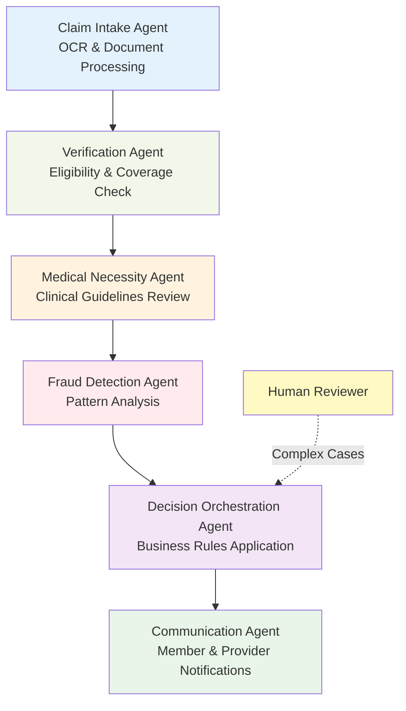
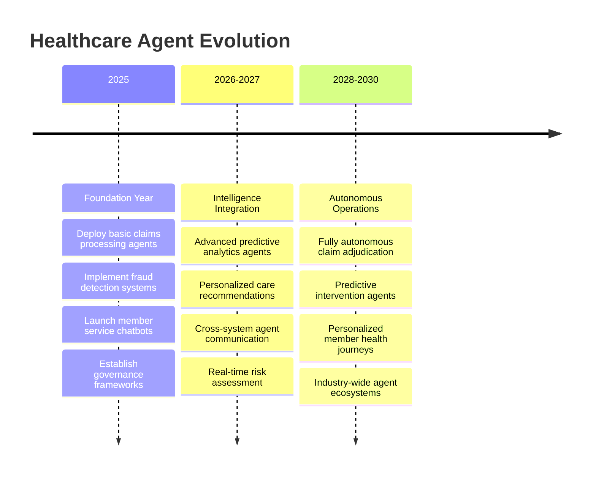

# Building Agents in Healthcare Enterprise

!!! info "Workshop Overview"
    **The Future is Agentic**: Transforming Healthcare & Insurance in 2025  
    Enterprise Tech Conference Workshop

---

## :rocket: Why AI Agents are the Future of 2025

<div class="grid cards" markdown>

-   :chart_with_upwards_trend: **65%**

    ---

    Companies experimenting with AI agents[^1]

-   :moneybag: **$52.6B**

    ---

    Projected AI agent market by 2030[^2]

-   :hospital: **500+**

    ---

    AI use cases at UnitedHealth[^3]

-   :globe_with_meridians: **$6T**

    ---

    Economic value by 2028[^4]

</div>

!!! success "Key Insight"
    **2025 marks the transition from AI experimentation to production-scale agent deployment** across enterprises.[^5]

### :crystal_ball: The Agent Revolution

=== "From Apps to Agents"
    "Where there once was 'an app for that,' there will now be 'an agent for that'"[^6]

=== "Autonomous Operations"
    Agents working 24/7 behind the scenes while humans sleep[^7]

=== "Multi-Agent Collaboration"
    Agents communicating with other agents across systems[^8]

=== "Human-AI Partnership"
    Empowering employees to focus on higher-value work[^9]

---

## :office_building: Enterprise Leaders Driving Agent Adoption

<div class="grid cards" markdown>

-   :material-microsoft: **Microsoft**

    ---

    - Azure AI Foundry Agent Service[^10]
    - Copilot Studio Agents
    - Supporting Agent2Agent (A2A) protocol[^11]
    - 1,900+ AI models available[^12]

-   :material-google: **Google Cloud**

    ---

    - Vertex AI Agents[^13]
    - Agent2Agent protocol creator[^14]
    - Multimodal AI leadership[^15]
    - Enterprise search transformation[^16]

-   :material-salesforce: **Salesforce**

    ---

    - Agentforce platform[^17]
    - Pre-built enterprise automation
    - Healthcare-specific agents
    - Customer engagement focus

-   :material-ibm: **IBM**

    ---

    - watsonx Agents[^18]
    - Strong governance framework
    - Compliance-first approach
    - Enterprise security focus

</div>

!!! note "Industry Movement"
    Major tech companies are standardizing agent protocols (A2A, MCP) to enable seamless cross-platform agent communication.[^19]

---

## :arrows_counterclockwise: Simple Multi-Agent Workflow: Travel Booking

```mermaid
graph LR
    A[User Intent<br/>"Book trip to Chicago"] --> B[Planning Agent<br/>Analyzes calendar & budget]
    B --> C[Flight Agent<br/>Searches & books tickets]
    C --> D[Hotel Agent<br/>Finds accommodations]
    D --> E[Coordination Agent<br/>Syncs calendar & tracks]
    
    style A fill:#e1f5fe
    style B fill:#f3e5f5
    style C fill:#e8f5e8
    style D fill:#fff3e0
    style E fill:#fce4ec
```

### :zap: Key Agent Capabilities

!!! example "Agent Capabilities"
    - **Context Awareness**: Understanding user preferences and corporate policies
    - **Real-time Decision Making**: Adapting to price changes and availability
    - **Cross-system Integration**: Working with multiple booking platforms
    - **Autonomous Execution**: Completing tasks without human intervention
    - **Continuous Learning**: Improving recommendations based on past trips

---

## :hospital: AI Agents Transforming Healthcare

<div class="grid cards" markdown>

-   :woman_health_worker: **Clinical Care Agents**

    ---

    - AI nurses for patient check-ins
    - Chronic disease monitoring
    - Cervical cancer screening discussions
    - Medication adherence tracking

-   :mag: **Diagnostic Support**

    ---

    - Medical imaging analysis
    - Symptom assessment chatbots
    - Second opinion generation
    - Pattern recognition in lab results

-   :clipboard: **Administrative Automation**

    ---

    - Appointment scheduling
    - Insurance verification
    - Medical record management
    - Billing and coding assistance

-   :lock: **Security & Compliance**

    ---

    - HIPAA compliance monitoring
    - Fraud detection systems
    - Access control management
    - Audit trail automation

</div>

!!! success "Real Examples"
    **Hippocratic AI** has deployed AI "nurses" across health systems, while companies like **Innovaccer** and **Salesforce** offer healthcare-specific agent platforms.

---

## :shield: Agents in Health Insurance: A Detailed Use Case

### :page_facing_up: Intelligent Claims Processing Agent Workflow



#### Step-by-Step Process

=== "1. Claim Intake Agent"
    **Function**: Automatically receives and categorizes incoming claims
    
    - Extracts key information using OCR and NLP
    - Classifies claim types and urgency levels
    - Routes to appropriate processing queues

=== "2. Verification Agent"
    **Function**: Validates member eligibility and coverage
    
    - Checks member status across databases
    - Verifies provider credentials
    - Confirms coverage details and benefits

=== "3. Medical Necessity Agent"
    **Function**: Reviews clinical documentation
    
    - Applies evidence-based guidelines
    - Checks prior authorization requirements
    - Assesses treatment appropriateness

=== "4. Fraud Detection Agent"
    **Function**: Identifies potential fraudulent activities
    
    - Analyzes billing patterns
    - Detects duplicate claims
    - Flags unusual provider behaviors

=== "5. Decision Orchestration Agent"
    **Function**: Coordinates all findings and makes decisions
    
    - Applies business rules and policies
    - Routes complex cases to human reviewers
    - Ensures regulatory compliance

=== "6. Communication Agent"
    **Function**: Manages stakeholder communications
    
    - Sends personalized member notifications
    - Updates provider portals
    - Tracks response requirements

!!! warning "Regulatory Consideration"
    **California's SB 1120** requires human physician review for AI-driven medical necessity decisions, highlighting the importance of human oversight in agent workflows.

---

## :money_with_wings: Business Impact of Healthcare Agents

<div class="grid cards" markdown>

-   :chart_increasing: **$260M**

    ---

    Savings from fraud detection (Highmark 2019)

-   :trending_up: **25%+**

    ---

    Operational cost reduction potential

-   :gear: **90%**

    ---

    Reduction in manual review tasks

-   :stopwatch: **50%**

    ---

    Faster claim processing times

</div>

### :chart_with_upwards_trend: Measurable Benefits

!!! tip "Operational Excellence"
    - **Efficiency**: Automate 70-80% of routine claims processing
    - **Cost Reduction**: Significant savings in administrative overhead
    - **Accuracy**: Reduce human error in data processing
    - **Fraud Prevention**: Advanced pattern recognition
    - **Member Satisfaction**: Faster claim resolution
    - **Compliance**: Consistent regulatory application

### :warning: Implementation Considerations

!!! caution "Key Challenges"
    - **Governance**: 78% of CIOs cite security and compliance as barriers
    - **Human Oversight**: Maintain physician review for complex decisions
    - **Data Quality**: Ensure clean, standardized data
    - **Change Management**: Train staff on agent-assisted workflows

---

## :construction_site: Healthcare Agent Roadmap 2025-2030



---

## :dart: Implementation Strategy

!!! question "Ready to Build Your Agent Strategy?"
    The future of healthcare is agentic. Organizations that act now will gain decisive competitive advantages.

<div class="grid cards" markdown>

-   :dart: **Start Small**

    ---

    Begin with pilot projects in claims processing or customer service

-   :building_construction: **Build Foundation**

    ---

    Establish data governance and security frameworks

-   :bar_chart: **Measure Impact**

    ---

    Track ROI through efficiency gains and cost reductions

-   :arrows_counterclockwise: **Scale Gradually**

    ---

    Expand successful agents across the organization

</div>

---

## :key: Key Takeaways

1. **The Agent Era is Now**: 2025 represents the inflection point for enterprise agent adoption
2. **Healthcare Leadership**: Insurance and healthcare are pioneering agent implementations
3. **Multi-Agent Systems**: The future involves agents collaborating autonomously
4. **Regulatory Balance**: Success requires balancing automation with human oversight
5. **Competitive Advantage**: Early adopters will gain significant operational advantages

!!! abstract "Bottom Line"
    **AI agents represent the next frontier of digital transformation in healthcare**. Organizations must start building their agent strategies now to remain competitive in the rapidly evolving landscape of 2025 and beyond.

---

## :link: Sources and References

[^1]: KPMG Survey - 65% of companies are experimenting with AI agents. Source: [Microsoft adopts Google's standard for linking up AI agents | TechCrunch](https://techcrunch.com/2025/05/07/microsoft-adopts-googles-standard-for-linking-up-ai-agents/)

[^2]: Markets and Markets projection - AI agent segment will grow from $7.84 billion in 2025 to $52.62 billion by 2030. Source: [Microsoft adopts Google's standard for linking up AI agents | TechCrunch](https://techcrunch.com/2025/05/07/microsoft-adopts-googles-standard-for-linking-up-ai-agents/)

[^3]: UnitedHealth CEO Andrew Witty: "It's completely exponential... Every use case is delivering at least double-digit percentage rates of efficiency." Source: [Health insurers race to embrace AI. Watchdogs say slow down | STAT](https://www.statnews.com/2025/03/25/health-insurers-ai-use-regulators-see-brewing-crisis-elevance-centen e-unitedhealth/)

[^4]: Futurum Research projection - agent-based AI will drive up to $6 trillion in economic value by 2028. Source: [The Rise of Agentic AI: The Leading Solutions Transforming Enterprise Workflows in 2025](https://futurumgroup.com/press-release/rise-of-agentic-ai-leading-solutions-transforming-enterprise-workflows-in-2025/)

[^5]: Google Cloud's Oliver Parker: "If 2024 was all about experimentation, 2025 will truly be the year enterprises scale AI." Source: [Google: AI agents, multimodal AI, enterprise search will dominate in 2025 | VentureBeat](https://venturebeat.com/ai/google-ai-agents-multimodal-ai-enterprise-search-will-dominate-in-2025/)

[^6]: Microsoft Dynamics 365 Blog: "Where there once was 'an app for that,' there will now be 'an agent for that'". Source: [How generative AI is reshaping business applications - Microsoft Dynamics 365 Blog](https://www.microsoft.com/en-us/dynamics-365/blog/business-leader/2025/05/20/the-autonomous-enterprise-how-generative-ai-is-reshaping-business-applications/)

[^7]: Google Cloud's Oliver Parker: "Moving forward, you'll see different agents talking to different agents, almost to the point where we all go to sleep at the end of the evening, and there's a series of tasks and things and actions that are happening behind the scenes." Source: [Google: AI agents, multimodal AI, enterprise search will dominate in 2025 | VentureBeat](https://venturebeat.com/ai/google-ai-agents-multimodal-ai-enterprise-search-will-dominate-in-2025/)

[^8]: Microsoft: "The best agents won't live in one app or cloud; they'll operate in the flow of work, spanning models, domains, and ecosystems." Source: [Microsoft adopts Google's standard for linking up AI agents | TechCrunch](https://techcrunch.com/2025/05/07/microsoft-adopts-googles-standard-for-linking-up-ai-agents/)

[^9]: Microsoft Dynamics 365: "By putting intelligent agents in the hands of every employee, organizations are empowering individuals to focus on higher-value work, make decisions faster, and drive innovation." Source: [How generative AI is reshaping business applications - Microsoft Dynamics 365 Blog](https://www.microsoft.com/en-us/dynamics-365/blog/business-leader/2025/05/20/the-autonomous-enterprise-how-generative-ai-is-reshaping-business-applications/)

[^10]: Microsoft Build 2025: "With the general availability of Azure AI Foundry Agent Service, Microsoft is bringing new capabilities to empower professional developers to orchestrate multiple specialized agents." Source: [Microsoft Build 2025: The age of AI agents and building the open agentic web](https://blogs.microsoft.com/blog/2025/05/19/microsoft-build-2025-the-age-of-ai-agents-and-building-the-open-agentic-web/)

[^11]: Microsoft announced support for Google's Agent2Agent (A2A) spec in Azure AI Foundry and Copilot Studio. Source: [Microsoft adopts Google's standard for linking up AI agents | TechCrunch](https://techcrunch.com/2025/05/07/microsoft-adopts-googles-standard-for-linking-up-ai-agents/)

[^12]: Microsoft Build 2025: "Developers can now choose from more than 1,900 partner-hosted and Microsoft-hosted AI models." Source: [Microsoft Build 2025: The age of AI agents and building the open agentic web](https://blogs.microsoft.com/blog/2025/05/19/microsoft-build-2025-the-age-of-ai-agents-and-building-the-open-agentic-web/)

[^13]: Google Cloud's Vertex AI Agents are part of their enterprise AI platform for managing complex workflows. Source: [Google Cloud: How AI Will Reshape Enterprise Tech in 2025 | Technology Magazine](https://technologymagazine.com/articles/google-cloud-how-ai-will-reshape-enterprise-tech-in-2025)

[^14]: Google unveiled the Agent2Agent (A2A) protocol in early April 2025. Source: [Microsoft adopts Google's standard for linking up AI agents | TechCrunch](https://techcrunch.com/2025/05/07/microsoft-adopts-googles-standard-for-linking-up-ai-agents/)

[^15]: Google Cloud's focus on multimodal AI systems that process images, audio, video and conversational prompts. Source: [Google Cloud: How AI Will Reshape Enterprise Tech in 2025 | Technology Magazine](https://technologymagazine.com/articles/google-cloud-how-ai-will-reshape-enterprise-tech-in-2025)

[^16]: Google Cloud Oliver Parker: "Enterprise search systems are no longer limited to keyword-based queries. People will now be able to use images, audio, video and conversational prompts." Source: [Google Cloud: How AI Will Reshape Enterprise Tech in 2025 | Technology Magazine](https://technologymagazine.com/articles/google-cloud-how-ai-will-reshape-enterprise-tech-in-2025)

[^17]: Futurum Research highlights Salesforce Agentforce as a leader in pre-built enterprise AI automation. Source: [The Rise of Agentic AI: The Leading Solutions Transforming Enterprise Workflows in 2025](https://futurumgroup.com/press-release/rise-of-agentic-ai-leading-solutions-transforming-enterprise-workflows-in-2025/)

[^18]: IBM watsonx Agents noted for strong governance frameworks and compliance. Source: [The Rise of Agentic AI: The Leading Solutions Transforming Enterprise Workflows in 2025](https://futurumgroup.com/press-release/rise-of-agentic-ai-leading-solutions-transforming-enterprise-workflows-in-2025/)

[^19]: Microsoft and other major AI model providers announced adoption of Google's A2A protocol and Anthropic's Model Context Protocol (MCP). Source: [Microsoft adopts Google's standard for linking up AI agents | TechCrunch](https://techcrunch.com/2025/05/07/microsoft-adopts-googles-standard-for-linking-up-ai-agents/)